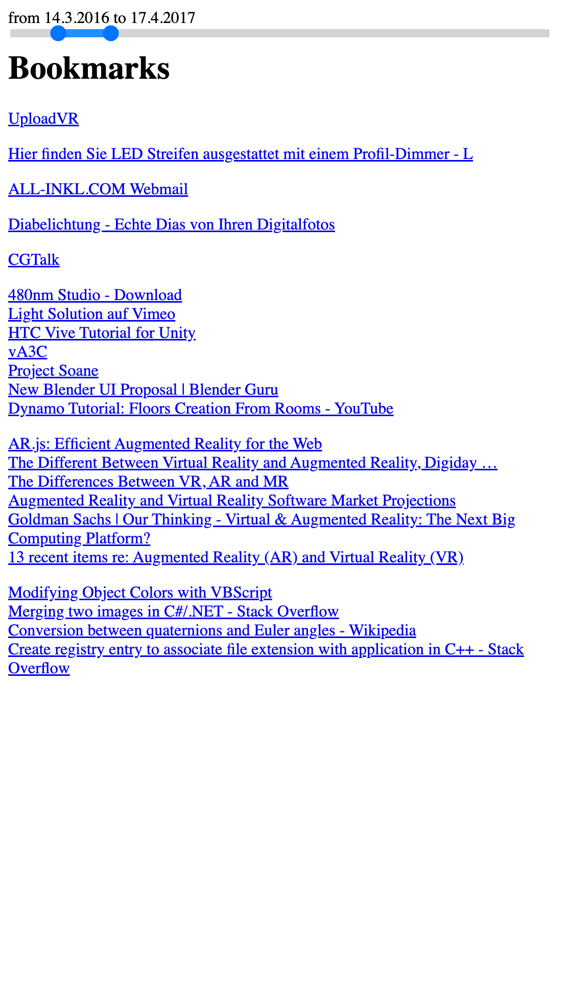

# timeslider-for-a-bookmarkfile

This small script demonstrates the benefit of having a timeslide for bookmarks.
Collecting bookmarks is happening during the whole digital lifetime, which can become decades.

Current browsers lets the user organise bookmarks in folders, subfolders and tags and sort the bookmarks by time.

**What if it would be possible to filter bookmarks by time?**

This tiny javascript give you a chance to find out by your own.

### How to use the script:
* Export your bookmarks
* Download the "slider.js"
* open the bookmars html in a texteditor
*  add this line in the header or body ..  

### What will it do?
The script add an element - a very basic slider - and an eventlistener
The script is looking for the first and last addes bookmark and set the date to the start and endpoint of the slider
The eventlistener listen to the slider start and end and will then set the filter for this range in time.

note: it's a demonstrator and not intended to be a codeexample! 
